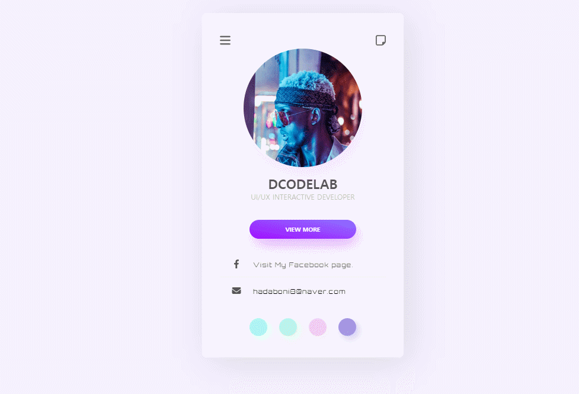
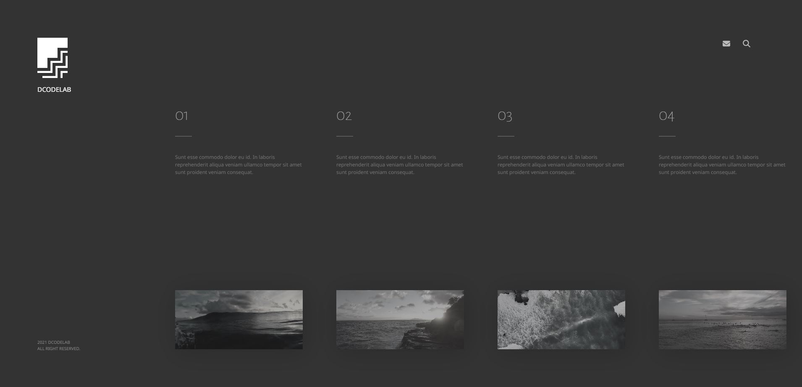
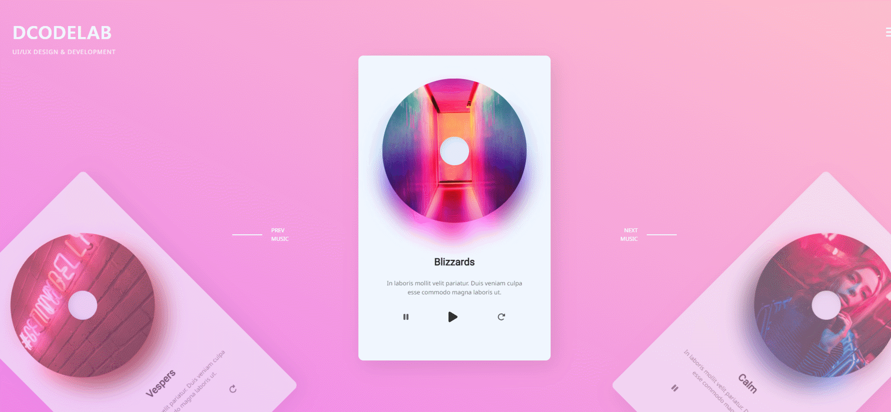
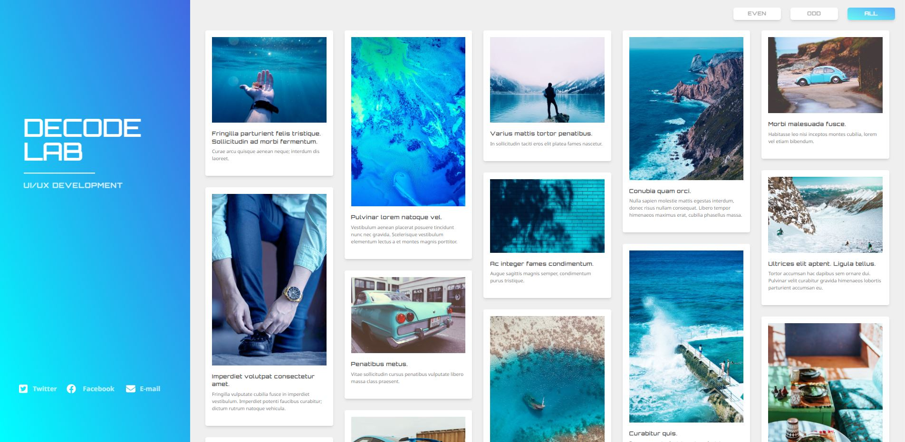

## 📓 Do it! 인터랙티브 웹 페이지 만들기

    
    
    
    
    
    
    

 <a href="https://ameliacode.github.io/doit_interactive_web">View Demo</a>

---

### Built with..
* 
* 

### License

Distributed under the MIT License. See LICENSE.txt for more information.
